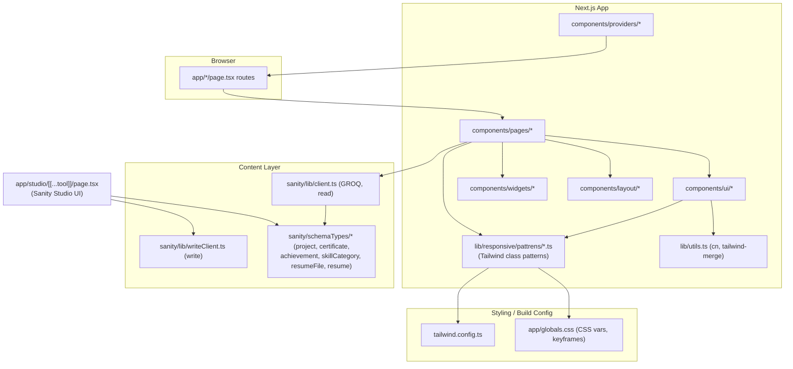
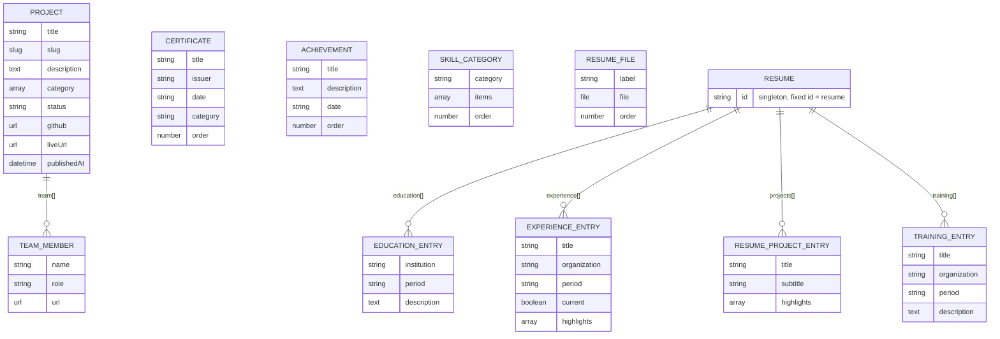
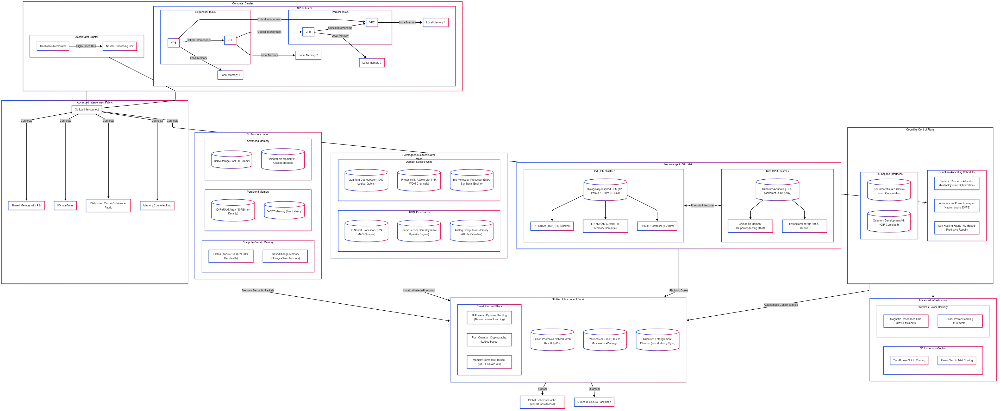

# Architecture Diagrams

## Portfolio App Architecture

Actual structure of this repo (Next.js App Router + Sanity CMS):

See [LAYOUT_DIMENSIONS.md](../maths/LAYOUT_DIMENSIONS.md) and [UI_COMPONENTS.md](../maths/UI_COMPONENTS.md) for the per-page and per-component breakdown of this diagram.

## Sanity Schema (Data Layer)

The `Schema` node above expands into these document types — see [db/SANITY_SCHEMA.md](../db/SANITY_SCHEMA.md) for the full field-level reference.

`CERTIFICATE`, `ACHIEVEMENT`, and `SKILL_CATEGORY` have no relations to other document types — they're standalone collections. `TEAM_MEMBER` and the `*_ENTRY` types are embedded objects (arrays-of-objects), not Sanity `reference` fields, so they only ever exist nested inside their parent document.

---

## Legacy Diagrams (unrelated to this codebase)

> **Note:** the two diagrams below (`mermaid-diagram-2025-02-27-064656.png`, `mermaid-diagram-2025-02-27-064818.svg`) depict a fictional/example hardware architecture — photonic interconnects, SPU clusters, quantum-annealing schedulers, neuromorphic grids. They do **not** describe this Next.js portfolio's design. They're kept here as historical assets rather than deleted; treat them as reference material only, not as documentation of this app.

[mermaid-diagram-2025-02-27-064818.svg](./mermaid-diagram-2025-02-27-064818.svg) (open directly — large SVG, not inlined here).
