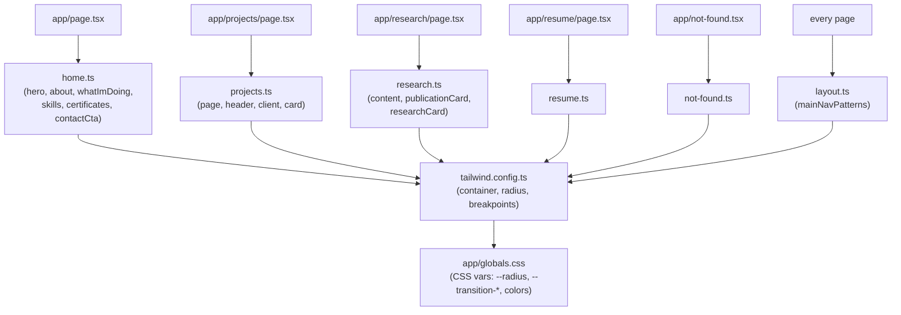

# Layout Dimensions Reference — All Pages

The numeric "math" behind every page's layout: container widths, breakpoints, element sizes (width × height), spacing, radii, and durations. Extracted from every file in [lib/responsive/pattrens/](../../lib/responsive/pattrens/) plus the global tokens in [tailwind.config.ts](../../tailwind.config.ts) and [app/globals.css](../../app/globals.css). Component-level sizing (Button/Badge/Card/etc.) is already covered in [UI_COMPONENTS.md](./UI_COMPONENTS.md) — this doc covers the **page-specific** pattern files: `home.ts`, `layout.ts`, `not-found.ts`, `projects.ts`, `research.ts`, `resume.ts`.to maths latex

## Page → Pattern File Map

Each page owns one pattern file; the shared nav (`mainNavPatterns` in `layout.ts`) is the only pattern set consumed by every page at once.

## Global Tokens (apply to every page)

| Token | Value | Source |
|---|---|---|
| Breakpoint `sm` | `640px` | Tailwind default |
| Breakpoint `md` | `768px` | Tailwind default |
| Breakpoint `lg` | `1024px` | Tailwind default |
| Breakpoint `xl` | `1280px` | Tailwind default |
| Breakpoint `2xl` (media query) | `1536px` | Tailwind default (unchanged) |
| `.container` padding | `2rem` (32px), centered | `tailwind.config.ts` → `theme.container` |
| `.container` max-width at `2xl` | `1400px` | `tailwind.config.ts` → `theme.container.screens["2xl"]` — **this is the container plugin's own `2xl`, distinct from the arbitrary `2xl:max-w-[1600px]` overrides below** |
| `--radius` | `0.75rem` (12px) | `app/globals.css:37` |
| `rounded-lg` | `var(--radius)` = 12px | `tailwind.config.ts` → `borderRadius.lg` |
| `rounded-md` | `calc(var(--radius) - 2px)` = 10px | `tailwind.config.ts` → `borderRadius.md` |
| `rounded-sm` | `calc(var(--radius) - 4px)` = 8px | `tailwind.config.ts` → `borderRadius.sm` |
| `--transition-fast` | `150ms` | `app/globals.css:47` |
| `--transition-normal` | `300ms` | `app/globals.css:48` |
| `--transition-slow` | `500ms` | `app/globals.css:49` |

Most `duration-*` utilities used in the pattern files below (`duration-200`, `duration-300`, `duration-500`, `duration-700`) are Tailwind's own scale, used directly rather than through the `--transition-*` CSS variables.

---

## Home Page — `lib/responsive/pattrens/home.ts`

Used by `components/pages/home/*`. Every section shares the same content container:

| Pattern export | Container max-width | Section vertical padding |
|---|---|---|
| `heroPatterns` | `max-w-6xl` (72rem/1152px), `2xl:max-w-[1600px]` | `py-20` (5rem) |
| `aboutPatterns` | `max-w-6xl`, `2xl:max-w-[1600px]` | `py-16` (4rem) |
| `whatImDoingPatterns` | `max-w-6xl`, `2xl:max-w-[1600px]` | `py-16` |
| `skillsPatterns` | `max-w-6xl`, `2xl:max-w-[1600px]` | `py-16` |
| `certificatesPatterns` | `max-w-6xl`, `2xl:max-w-[1600px]`, `space-y-16` | `py-16` |
| `contactCtaPatterns` | `max-w-6xl`, `2xl:max-w-[1600px]` | `py-16` |

So every home section is capped at **1152px** up to the `2xl` breakpoint (1536px), then widens to **1600px** beyond it — a custom arbitrary value, not a Tailwind default.

### Hero (`heroPatterns`)

| Element | Size |
|---|---|
| Layout | `flex-col` (mobile) → `md:flex-row` (≥768px), `gap-12` (3rem) |
| Avatar frame | `w-48 h-48` (192×192px) → `md:w-64 md:h-64` (256×256px) |
| Avatar border | `border-4` (4px), `border-accent/20` |
| Avatar glow blur | `blur-2xl`, `opacity-50` |
| Heading | `text-4xl` (2.25rem) → `md:text-5xl` (3rem) |
| Typing wrapper height | `h-10` (2.5rem/40px), fixed to prevent layout shift |
| Tagline max-width | `max-w-2xl` (42rem/672px) |
| CTA row gap | `gap-4` (1rem) |
| Social row gap/margin | `gap-4`, `mt-8` (2rem) |

### What I'm Doing / Skills grids

| Element | Size |
|---|---|
| Grid columns | 1 (mobile) → `md:grid-cols-2` → `lg:grid-cols-4` |
| Grid gap | `gap-6` (1.5rem) |
| Card padding | `p-6` (1.5rem) |
| Card hover scale | `hover:scale-[1.02]` |
| Icon wrapper | `w-16 h-16` (64×64px), `rounded-xl` |
| Icon | `w-8 h-8` (32×32px) |
| Skill bullet dot | `w-1.5 h-1.5` (6×6px) |

### Contact CTA

| Element | Size |
|---|---|
| Card padding | `p-12` (3rem) |
| Card radius | `rounded-3xl` (1.5rem/24px) |
| Content max-width | `max-w-3xl` (48rem/768px), centered |
| Button padding | `px-8` (2rem horizontal) |
| Button hover scale | `hover:scale-105` |

---

## Global Nav — `lib/responsive/pattrens/layout.ts` (`mainNavPatterns`)

Fixed bottom-center pill navigation, shared across every page via `components/layout`.

| Element | Size |
|---|---|
| Root position | `fixed`, `bottom-0`, `z-50`, `p-4` (1rem) padding around the pill |
| Mobile pill padding | `p-1.5` (0.375rem) |
| Mobile pill radius | `rounded-full` |
| Desktop nav padding | `px-8 py-3` (2rem horizontal / 0.75rem vertical) |
| Desktop nav gap | `md:gap-8` (2rem) between links |
| Desktop hover scale | `hover:scale-[1.02]` |
| Link active/hover scale | `hover:scale-105`, `active:scale-95` |
| External-link icon (desktop) | `h-3 w-3` (12×12px) |
| External-link icon (mobile) | `h-4 w-4` (16×16px) |
| Mobile sheet radius | `rounded-t-3xl` (top corners, 1.5rem) |
| Mobile sheet transition | `duration-500` |
| Mobile link padding | `px-4 py-3` |
| Scroll-to-top button offset | `bottom-20 right-4` (5rem / 1rem) → `md:bottom-24` (6rem) |

---

## Not Found (404) — `lib/responsive/pattrens/not-found.ts`

| Element | Size |
|---|---|
| Container padding | `px-4 py-24` (1rem horizontal / 6rem vertical) |
| Container gap | `space-y-6` (1.5rem) |
| `h1` size | `text-6xl` (3.75rem/60px) |
| Divider | `h-1 w-20` (4px tall × 80px wide) |
| `h2` size | `text-2xl` (1.5rem) |
| Paragraph max-width | `max-w-md` (28rem/448px) |

---

## Projects Page — `lib/responsive/pattrens/projects.ts`

| Pattern | Element | Size |
|---|---|---|
| `projectsPagePatterns` | Container | `container mx-auto`, `space-y-6` (1.5rem) |
| `projectsHeaderPatterns` | Title | `text-4xl` (2.25rem) |
| `projectsHeaderPatterns` | Divider | `h-1 w-16` (4px × 64px) |
| `projectsHeaderPatterns` | Header layout | `flex-col` → `md:flex-row`, `gap-4` (1rem) |
| `projectsClientPatterns` | Content top margin | `mt-6` (1.5rem) |
| `projectsClientPatterns` | Grid columns | 1 (mobile) → `sm:grid-cols-2` → `lg:grid-cols-3` |
| `projectsClientPatterns` | Grid gap | `gap-6` (1.5rem) |
| `projectsClientPatterns` | Empty state padding | `py-12` (3rem) |
| `projectCardPatterns` | Image aspect ratio | `aspect-video` (16:9) |
| `projectCardPatterns` | Image hover scale | `hover:scale-105` |
| `projectCardPatterns` | Title line clamp | `line-clamp-2` |
| `projectCardPatterns` | Description line clamp | `line-clamp-3` |
| `projectCardPatterns` | Tech tag row gap | `gap-2` (0.5rem) |
| `projectCardPatterns` | Footer padding | `pt-4` (1rem) |

---

## Research Page — `lib/responsive/pattrens/research.ts`

| Pattern | Element | Size |
|---|---|---|
| `researchContentPatterns` | Container | `px-4 py-12` (1rem / 3rem), `space-y-12` (3rem) |
| `researchContentPatterns` | Title | `text-4xl` (2.25rem) |
| `researchContentPatterns` | Divider | `h-1 w-20` (4px × 80px), `mt-2` |
| `researchContentPatterns` | Section heading | `text-2xl` (1.5rem), `mb-6` (1.5rem) |
| `researchContentPatterns` | Grid gap | `gap-6` (1.5rem) — no explicit column breakpoints (single-column list) |
| `researchCardPatterns` | Card height | `h-full` (fills grid cell) |
| `researchCardPatterns` | Title | `text-xl` (1.25rem) |
| `researchCardPatterns` | Status badge padding | `px-3 py-1` (0.75rem / 0.25rem) |
| `researchCardPatterns` | Status badge radius | `rounded-full` |
| `researchCardPatterns` | Tech badge padding | `px-3 py-1`, `rounded-full` |
| `publicationCardPatterns` | Title | `text-lg` (1.125rem) |

---

## Resume Page — `lib/responsive/pattrens/resume.ts`

| Element | Size |
|---|---|
| Container | `container mx-auto py-8` (2rem vertical) |
| Title | `text-4xl` (2.25rem), `mb-8` (2rem) |
| Dropdown wrapper margin | `mb-8` (2rem) |
| Sections grid gap | `gap-8` (2rem) |
| Section heading | `text-2xl` (1.5rem), `mb-4` (1rem) |
| Items list gap | `space-y-4` (1rem) |
| Card padding | `p-4` (1rem) |
| Item title | `text-xl` (1.25rem) |
| Highlights list indent | `pl-4` (1rem), `space-y-2` (0.5rem) |

---

## Cross-Page Comparison

Quick side-by-side of the recurring "shape" values so pages stay visually consistent:

| Concern | Home | Projects | Research | Resume | Not Found |
|---|---|---|---|---|---|
| Page-level container | `max-w-6xl 2xl:max-w-[1600px]` | `container mx-auto` (default `2xl:1400px`) | `container mx-auto px-4` | `container mx-auto` | `container mx-auto px-4` |
| Section vertical rhythm | `py-16` / `py-20` | `space-y-6` | `py-12`, `space-y-12` | `py-8` | `py-24` |
| Card grid gap | `gap-6` | `gap-6` | `gap-6` | `gap-8` | — (no grid) |
| H1/title size | `text-4xl md:text-5xl` (hero) | `text-4xl` | `text-4xl` | `text-4xl` | `text-6xl` |
| Accent divider | — | `h-1 w-16` | `h-1 w-20` | — | `h-1 w-20` |

**Inconsistency worth noting:** the Home page sections use a custom `max-w-6xl 2xl:max-w-[1600px]` container, while Projects/Research/Resume/Not-Found use the plain `container` class (capped at `1400px` from `tailwind.config.ts`). This is a real difference in max page width between the home page and the rest of the site, not a typo — flag it if the intent is for every page to match.

## Known Dead Classes

Two custom animation utility classes are referenced in pattern files but are **not defined** anywhere in `app/globals.css` or `tailwind.config.ts` (no matching `@keyframes`/`animation` entry, and `tailwindcss-animate` doesn't ship them either):

- `animate-slide-up` / `animate-slide-down` — `lib/responsive/pattrens/layout.ts` (`mainNavPatterns.sheetContentSlideUp` / `sheetContentSlideDown`)
- `animate-blink` — `lib/responsive/pattrens/ui.ts` (`typingEffectPatterns.cursor`)

These currently no-op (no animation runs) since Tailwind drops unknown `animate-*` utilities silently.
