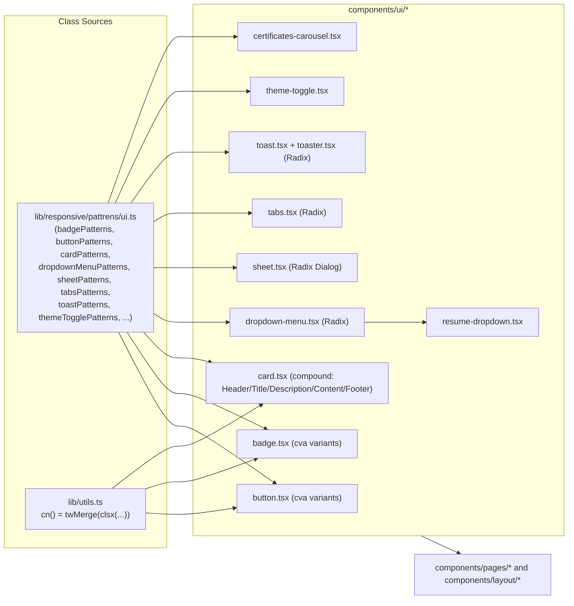

# UI Components & CSS Reference

Reference for the components in [components/ui/](../../components/ui/) and the Tailwind class patterns behind them, defined in [lib/responsive/pattrens/ui.ts](../../lib/responsive/pattrens/ui.ts).

All components read their classes from that `ui.ts` patterns file (not inline strings) and merge overrides via `cn()` in [lib/utils.ts](../../lib/utils.ts), which combines `clsx` + `tailwind-merge`.

## Component Architecture



Every primitive is a thin wrapper: variant/size classes live in `ui.ts`, the component itself only wires `cva`/`cn` and Radix behavior — never inline Tailwind strings.

## Button — `components/ui/button.tsx`

Built with `class-variance-authority` (`cva`) on top of `buttonPatterns`.

**Base classes** (`buttonPatterns.base`):
```
inline-flex items-center justify-center whitespace-nowrap rounded-md text-sm font-medium
ring-offset-background transition-colors
focus-visible:outline-none focus-visible:ring-2 focus-visible:ring-ring focus-visible:ring-offset-2
disabled:pointer-events-none disabled:opacity-50
```

**Variants** (`variant` prop):

| Variant | Classes |
|---|---|
| `default` | `bg-primary text-primary-foreground hover:bg-primary/90` |
| `destructive` | `bg-destructive text-destructive-foreground hover:bg-destructive/90` |
| `outline` | `border border-input bg-background hover:bg-accent hover:text-accent-foreground` |
| `secondary` | `bg-secondary text-secondary-foreground hover:bg-secondary/80` |
| `ghost` | `hover:bg-accent hover:text-accent-foreground` |
| `link` | `text-primary underline-offset-4 hover:underline` |
| `gradient` | `bg-gradient-to-r from-primary to-primary/70 text-primary-foreground hover:from-primary/90 hover:to-primary/60` |

**Sizes** (`size` prop):

| Size | Classes |
|---|---|
| `default` | `h-10 px-4 py-2` |
| `sm` | `h-9 rounded-md px-3` |
| `lg` | `h-11 rounded-md px-8` |
| `icon` | `h-10 w-10` |

**Usage:**
```tsx
<Button variant="gradient" size="lg">Contact Me</Button>
<Button variant="outline" size="icon"><Icon /></Button>
<Button asChild><Link href="/projects">View Projects</Link></Button>
```

`asChild` uses Radix `Slot` to render the button's classes onto a child element instead of a `<button>`.

## Badge — `components/ui/badge.tsx`

**Base:** `inline-flex items-center rounded-full border px-2.5 py-0.5 text-xs font-semibold transition-colors focus:outline-none focus:ring-2 focus:ring-ring focus:ring-offset-2`

| Variant | Classes |
|---|---|
| `default` | `border-transparent bg-primary text-primary-foreground hover:bg-primary/80` |
| `secondary` | `border-transparent bg-secondary text-secondary-foreground hover:bg-secondary/80` |
| `destructive` | `border-transparent bg-destructive text-destructive-foreground hover:bg-destructive/80` |
| `outline` | `text-foreground` |

## Card — `components/ui/card.tsx`

Compound component: `Card`, `CardHeader`, `CardTitle`, `CardDescription`, `CardContent`, `CardFooter`.

| Part | Classes |
|---|---|
| `Card` (root) | `rounded-lg border bg-card text-card-foreground shadow-sm card-hover glass` |
| `CardHeader` | `flex flex-col space-y-1.5 p-6` |
| `CardTitle` | `text-2xl font-semibold leading-none tracking-tight gradient-text` |
| `CardDescription` | `text-sm text-muted-foreground` |
| `CardContent` | `p-6 pt-0` |
| `CardFooter` | `flex items-center p-6 pt-0` |

`card-hover`, `glass`, and `gradient-text` are custom utility classes (defined in global CSS, not Tailwind core) used for the hover-lift/glassmorphism/gradient-text effects seen across the site.

## Dropdown Menu — `components/ui/dropdown-menu.tsx`

Wraps `@radix-ui/react-dropdown-menu`. Key classes from `dropdownMenuPatterns`:
- `content` / `subContent`: `z-50 min-w-[8rem] overflow-hidden rounded-md border bg-popover p-1 text-popover-foreground shadow-md` + Radix `data-[state]`/`data-[side]` animation utilities (`animate-in`/`animate-out`, `fade-*`, `zoom-*`, `slide-in-from-*`).
- `item`: `relative flex cursor-default select-none items-center gap-2 rounded-sm px-2 py-1.5 text-sm outline-none transition-colors focus:bg-accent focus:text-accent-foreground data-[disabled]:pointer-events-none data-[disabled]:opacity-50`
- `separator`: `-mx-1 my-1 h-px bg-muted`
- `shortcut`: `ml-auto text-xs tracking-widest opacity-60`

Used by `components/ui/resume-dropdown.tsx` for the résumé download menu.

## Sheet — `components/ui/sheet.tsx`

Slide-out panel (Radix Dialog under the hood). Side variants pick the slide direction:

| Side | Classes |
|---|---|
| `top` | `inset-x-0 top-0 data-[state=closed]:slide-out-to-top data-[state=open]:slide-in-from-top` |
| `bottom` | `inset-x-0 bottom-0 data-[state=closed]:slide-out-to-bottom data-[state=open]:slide-in-from-bottom` |
| `left` | `inset-y-0 left-0 h-full w-3/4 ... sm:max-w-sm` |
| `right` | `inset-y-0 right-0 h-full w-3/4 ... sm:max-w-sm` |

`overlay`: `fixed inset-0 z-50 bg-black/80` with fade in/out.

## Tabs — `components/ui/tabs.tsx`

| Part | Classes |
|---|---|
| `list` | `inline-flex h-10 items-center justify-center rounded-md bg-muted p-1 text-muted-foreground` |
| `trigger` | `... data-[state=active]:bg-background data-[state=active]:text-foreground data-[state=active]:shadow-sm` |
| `content` | `mt-2 ring-offset-background focus-visible:outline-none focus-visible:ring-2 focus-visible:ring-ring focus-visible:ring-offset-2` |

## Toast / Toaster — `components/ui/toast.tsx`, `toaster.tsx`

Radix Toast wrapper. `variantDestructive` swaps to `border-destructive bg-destructive text-destructive-foreground` for error toasts; swipe-to-dismiss classes handle `data-[swipe=*]` gesture states.

## Theme Toggle — `components/ui/theme-toggle.tsx`

A pill-shaped switch, not a native checkbox:
- `track`: `h-8 w-16 rounded-full` — `bg-slate-700` (dark) / `bg-amber-100` (light)
- `thumb`: `h-6 w-6 rounded-full` — translates `translate-x-8` (dark) / `translate-x-0` (light)
- Sun/moon icons cross-fade via `opacity-100`/`opacity-0`.

## Animated / Scroll Section — `animated-section.tsx`, `scroll-section.tsx`

Intersection-observer-driven reveal animations:
```
transform transition-all duration-700 ease-out
hidden:  opacity-0 translate-y-8   (or translate-x-8 / -translate-x-8 for left/right)
visible: opacity-100 translate-y-0/translate-x-0
```

## Typing Effect — `components/ui/typing-effect.tsx`

Gradient text with a blinking cursor:
```
text-xl font-medium bg-gradient-to-r from-primary via-primary/80 to-primary/60 bg-clip-text text-transparent
```
Cursor: `animate-blink text-primary` (`animate-blink` is a custom keyframe utility, not stock Tailwind).

## Certificates Carousel — `components/ui/certificates-carousel.tsx`

Horizontal scroll-snap row of certificate cards:
- `scrollRow`: `flex gap-6 overflow-x-auto no-scrollbar scroll-smooth`
- `item`: `flex-none w-48 h-48 rounded-xl border border-border/40 bg-card p-4 shadow-sm hover:scale-105 hover:shadow-md`
- Nav arrows (`navLeft`/`navRight`) are hidden until the row is hovered: `opacity-0 group-hover:opacity-100`.

## Design Tokens in Use

Classes throughout rely on CSS variables mapped to Tailwind theme colors (`bg-primary`, `text-foreground`, `bg-muted`, `bg-popover`, `border-input`, etc.) rather than hard-coded colors — these resolve differently in light/dark mode via `next-themes`. Custom (non-Tailwind-core) utility classes used across components: `glass`, `card-hover`, `gradient-text`, `no-scrollbar`, `animate-blink`.

## Adding a New Variant

1. Add the class string to the relevant `*Patterns` object in `lib/responsive/pattrens/ui.ts` — never inline new Tailwind strings directly in a component file.
2. Wire it into the component's `cva()` variants map.
3. Reuse `cn()` for any consumer-supplied `className` override so Tailwind conflicts resolve correctly (`tailwind-merge`).
